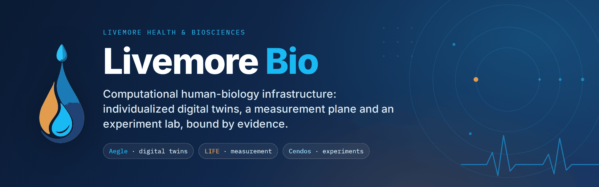
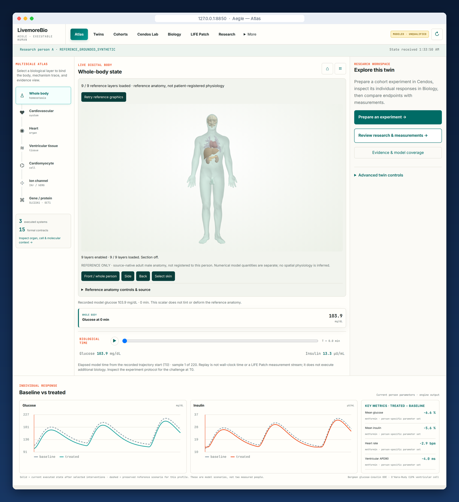
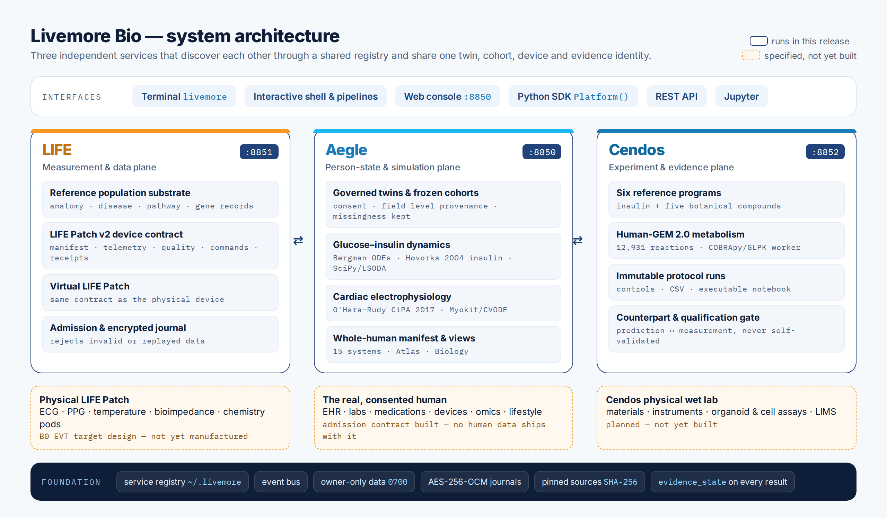
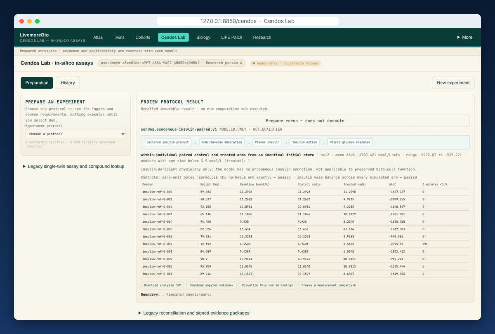
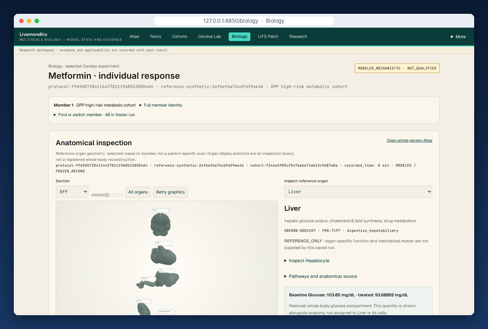
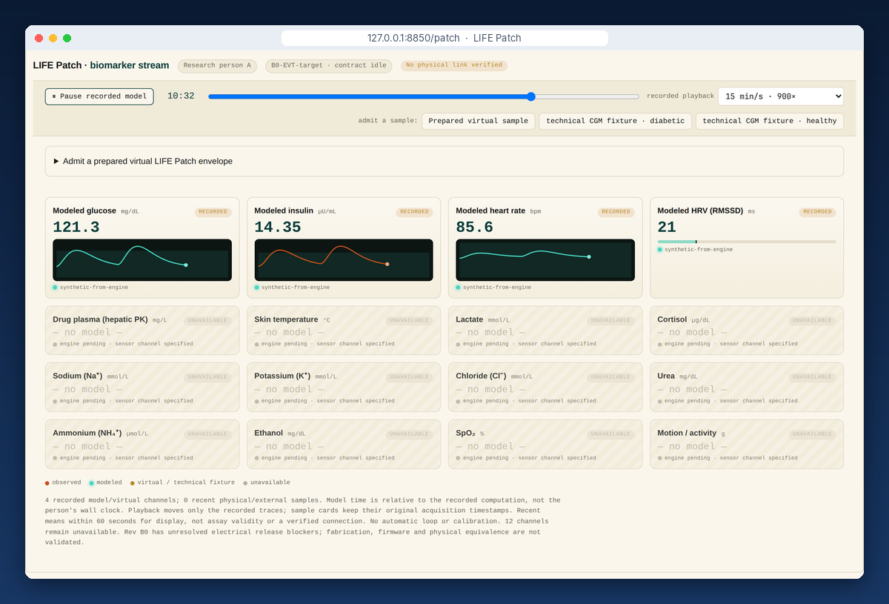
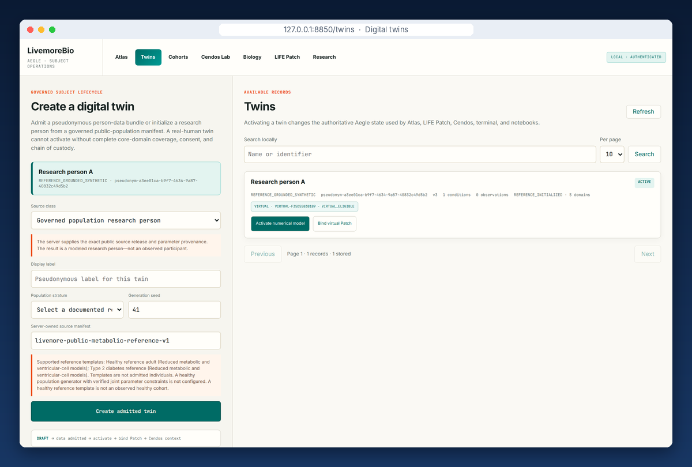

<div align="center">



<br>

**Computational human-biology infrastructure for drug development and precision medicine.**<br>
Individualized digital twins, a measurement plane and an experiment lab, run from one terminal and bound together by evidence.

<br>

[](stable.json)
[](LICENSE)
[](#requirements)
[](#installation)
[](#evidence-model-and-honest-boundaries)
[](#the-six-reference-programs)

[**Install**](#installation) ·
[**Quickstart**](#quickstart) ·
[**Full install guide**](INSTALL.md) ·
[**Evidence status**](#evidence-model-and-honest-boundaries) ·
[**Report an issue**](https://github.com/MannyAmah/livemorebio-dist/issues) ·
[**livemoreai.com**](https://www.livemoreai.com)

</div>

<br>

<p align="center">
  
</p>
<p align="center"><sub><b>Aegle Atlas</b> on a clean install of this release: an admitted research twin, 9 of 9 reference-anatomy layers, and a metformin intervention run through that individual's reduced glucose–insulin model (mean glucose −6.6 %, mean insulin −5.6 %). The heart-rate and APD90 deltas pass through a metabolic→cardiac coupling rule that is still an unsourced hypothesis. Metformin's hepatic exposure path counts as the third, partially executed system. Everything shown is model output, labelled <code>MODELED · UNQUALIFIED</code> in the header.</sub></p>

> [!IMPORTANT]
> **Livemore Bio is research infrastructure.** It is not a medical device, not clinical decision support and not dosing guidance. Nothing it produces is a measurement taken from a person, and every result says so. The six reference programs are **0 of 6 validated in vivo**. The physical LIFE Patch and the Cendos wet lab are **not built yet**.

---

## Table of contents

- [About Livemore Bio](#about-livemore-bio)
  - [The mission](#the-mission)
  - [What this release is](#what-this-release-is)
  - [Who it is for](#who-it-is-for)
  - [What makes it different](#what-makes-it-different)
- [Platform overview](#platform-overview)
- [Key capabilities](#key-capabilities)
- [Screenshots](#screenshots)
- [Whole-human coverage](#whole-human-coverage)
- [Installation](#installation)
  - [Requirements](#requirements)
  - [Native install (macOS, Linux, WSL2)](#native-install-macos-linux-wsl2)
  - [Docker (Windows and every other OS)](#docker-windows-and-every-other-os)
  - [Manual install from the release archive](#manual-install-from-the-release-archive)
- [Quickstart](#quickstart)
- [Usage](#usage)
  - [Terminal](#terminal)
  - [Web console](#web-console)
  - [Python SDK](#python-sdk)
  - [REST API](#rest-api)
  - [Jupyter](#jupyter)
- [The six reference programs](#the-six-reference-programs)
- [Worked examples](#worked-examples)
- [Evidence model and honest boundaries](#evidence-model-and-honest-boundaries)
- [Security and data protection](#security-and-data-protection)
- [Technology](#technology)
- [Roadmap](#roadmap)
- [What is in this repository](#what-is-in-this-repository)
- [Troubleshooting and support](#troubleshooting-and-support)
- [Partner with us](#partner-with-us)
- [About Livemore Health & Biosciences](#about-livemore-health--biosciences)
- [Citing Livemore Bio](#citing-livemore-bio)
- [Acknowledgements and third-party sources](#acknowledgements-and-third-party-sources)
- [License](#license)

---

## About Livemore Bio

Livemore Bio is the computational-biology platform of **Livemore Health & Biosciences**. It is built for biotech and pharmaceutical research: to represent a specific human's biology, test an intervention against it, and say exactly how far each answer can be trusted.

### The mission

Livemore Bio is being built toward one target: an **individualized, living, biological replica of a human being**. That is not an avatar or a dashboard. The goal is a digital human whose organs, tissues, cells, genes, proteins and molecules do their biological work and respond according to *that person's own* properties, so that Person A's twin is not Person B's.

Three connected systems carry that target. What exists today is in the next section.

- **Aegle**, the digital twin. The aim is one individualized twin per person, from atoms and molecules up to whole-body regulation.
- **LIFE**, the measurement plane. It is designed around the **LIFE Patch**, a purpose-built skin-worn sensing device (specified, not yet manufactured). The physical patch will belong to the real human and its virtual counterpart to that human's twin, with both using the same device contract.
- **Cendos**, the lab. It runs computational protocols today and is planned to include a **real physical wet lab**, so that predictions can be checked against independent measurements.

The systems are designed to talk in both directions. One rule already applies throughout: results, perturbations and observations are **never invented** to make a demonstration succeed.

### What this release is

This release is the working foundation for that mission, not the finished replica. Here is what you can install and run today:

| Area | Status in this release |
|---|---|
| Body systems in the whole-human contract | **15 of 15** registered and reference-backed |
| Body systems with executable, coupled models | **2**: endocrine (glucose–insulin) and cardiovascular (ventricular electrophysiology). Their coupling rule is a labelled hypothesis |
| Genome-scale human metabolism | **Human-GEM 2.0**: 12,931 reactions, 8,461 metabolites, 2,848 genes, run in Cendos |
| Reference programs | **6**. Each one runs, runs partially, or refuses and names the missing measurement |
| Person-calibrated, context-validated or independently replicated systems | **0** |
| Physical LIFE Patch hardware | B0 EVT design target. **Not manufactured** |
| Cendos physical wet lab | **Planned. Not built** |

### Who it is for

- **Pharmaceutical and biotech R&D teams** who want mechanistic, individualized hypothesis testing with a full audit trail.
- **Translational and computational scientists** who need executable physiology, genome-scale metabolism and reproducible notebooks in one place.
- **Research, device and laboratory partners** who can supply the physical measurements that turn a model into evidence.
- **Technical evaluators** doing due diligence. See [how to evaluate us](#how-to-evaluate-us).

### What makes it different

| Principle | What it means in practice |
|---|---|
| **Individual by construction** | Each twin keeps its own parameters and their sources. Cohorts are frozen sets of distinct synthetic member profiles, not one template with noise added to the outcome. |
| **Mechanistic and interpretable** | The engines are published models where they exist: Bergman glucose–insulin ODEs, the Hovorka insulin model, O'Hara–Rudy CiPA 2017 electrophysiology and Human-GEM. In-house or heuristic components, such as metformin's pharmacodynamic gains and the metabolic→cardiac coupling, are labelled as research assumptions. Every output can be traced back to its mechanism. |
| **Refuses instead of inventing** | Ask a question the evidence cannot answer and you get a typed refusal that names the missing measurement, not a plausible-looking number. |
| **Evidence travels with every number** | Every result carries its evidence and qualification state and its controls. Depending on the protocol, it also carries applicability, allowed and prohibited claims, and the pinned source and solver behind it. |
| **Infrastructure, not a web app** | Three services run from the terminal. The browser console, Python SDK, REST API and Jupyter all see the same twin, cohort, device and evidence identities. |

---

## Platform overview

<p align="center">
  
</p>

| System | Port | Role | What runs today |
|---|:--:|---|---|
| **Aegle** | `8850` | Person state and simulation. Also serves the console | Governed twins and frozen cohorts, glucose–insulin and cardiac engines, the whole-human manifest, Atlas and Biology views |
| **LIFE** | `8851` | Measurement and data plane | Reference population substrate, the LIFE Patch v2 device contract, the virtual patch, and an encrypted admission journal |
| **Cendos** | `8852` | Experiments and evidence | Six reference programs, Human-GEM protocols, immutable protocol runs with CSV and notebook export, and a counterpart and qualification gate |

The three services find each other through a shared registry (`~/.livemore/registry.json`) and share one authoritative active twin. Aegle and LIFE communicate through the virtual-patch session, and Cendos gets its twin and cohort context from Aegle. The same observation contract is ready for the physical patch once it exists.

---

## Key capabilities

<table>
<tr>
<td width="50%" valign="top">

### 🧬 Individualized twins and cohorts

- Admit a **consented real-human** profile with field-level EHR, laboratory, device, medication, genomic, lifestyle and environmental provenance. Missing domains stay missing.
- Or create a **non-person research twin** on the server from a pinned public-population manifest (NHANES 2021–2023 and published DPP baseline anchors).
- **Frozen cohorts** record their synthetic member profiles, seeds, source lineage and fingerprints. Synthetic and real-human members are never mixed.
- Exactly **one twin is authoritative** across Atlas, LIFE Patch, Cendos, the terminal and notebooks.

</td>
<td width="50%" valign="top">

### 🫀 Executable physiology

- **Glucose–insulin dynamics**: reduced Bergman ODEs solved with SciPy/LSODA.
- **Exogenous insulin**: the published Hovorka model, with source lineage for every parameter.
- **Ventricular electrophysiology**: O'Hara–Rudy CiPA 2017 (49 states), run natively through Myokit/CVODE from CellML. It models the hERG/IKr block → APD prolongation mechanism.
- **Cross-scale coupling rules** between metabolic and cardiac state. Their magnitude has no admitted source yet, and they are labelled as hypotheses.

</td>
</tr>
<tr>
<td valign="top">

### 🧪 Cendos in-silico lab

- **Six reference programs**: exogenous insulin plus five botanical compounds ([details](#the-six-reference-programs)).
- **Human-GEM 2.0** constraint-based metabolism in an isolated COBRApy/GLPK worker, with GPR-aware gene knockouts and negative controls.
- Protocols for **metformin across two cohorts**, **garcinoic acid → human PXR** and a **lobeline/VMAT2** initial-rate assay.
- Every run made through the services is **immutable**. It can be reopened, re-run with a parent link, and exported as **CSV and an executable Jupyter notebook**.

</td>
<td valign="top">

### 📡 LIFE measurement plane

- **LIFE Patch v2 contract**: manifest, telemetry, quality, commands and receipts, shared by the physical and virtual device.
- The **virtual LIFE Patch** binds to a twin and streams modeled channels. Unmodeled channels show `UNAVAILABLE`.
- Admission **rejects invalid or replayed data** and writes an encrypted journal. Telemetry updates observed state only and never silently recalibrates the model.
- The B0 hardware target (MAX30003 ECG, MAX86141 optical, AD5940 electrochemistry, DS28C36 pod authentication) is **specified, not manufactured**.

</td>
</tr>
<tr>
<td valign="top">

### 📑 Evidence and provenance

- `evidence_state` and `qualification_state` on every result, plus `applicability` and `interpretation_limits` where the protocol defines them.
- `claims_allowed` and `claims_prohibited` state what a result can and cannot support.
- **Controls run on every execution.** For example, a zero-dose arm must reproduce the untreated arm exactly.
- Pinned model commits and SHA-256 digests, solver versions, and literature lineage for each parameter.

</td>
<td valign="top">

### 🗺️ Governed knowledge and sources

- A **whole-human manifest** with an eight-step maturity ladder for each body system ([below](#whole-human-coverage)).
- A **scientific-source catalog** of 2,647 entries: all 39 ELIXIR Core Data Resources, 2,594 NAR database summaries and 14 Livemore adapters. Each entry moves through a lifecycle from `cataloged` to `scientifically_qualified`. Catalog entries are never queried by experiments until they are wired and qualified.
- Adapter readiness, license links and credential gates. Commercially restricted sources (for example KEGG, GeneCards, Recon3D) **fail closed** without entitlement.
- A knowledge graph (Gene ↔ Disease ↔ Pathway ↔ Organ ↔ Drug) and a TF-IDF retrieval index.

</td>
</tr>
</table>

---

## Screenshots

These were all captured from a clean install of this release (`6588707`), by running the workflows shown.

<table>
<tr>
<td width="50%"></td>
<td width="50%"></td>
</tr>
<tr>
<td align="center"><sub><b>Cendos Lab</b>: paired insulin arms for 12 members, with controls passed and CSV and notebook export</sub></td>
<td align="center"><sub><b>Biology</b>: one member's metformin response, tied to reference anatomy and the frozen run</sub></td>
</tr>
<tr>
<td width="50%"></td>
<td width="50%"></td>
</tr>
<tr>
<td align="center"><sub><b>LIFE Patch</b>: 4 modeled channels. The other 12 show as unavailable instead of being faked</sub></td>
<td align="center"><sub><b>Digital twins</b>: governed admission, activation and virtual-patch binding</sub></td>
</tr>
</table>

---

## Whole-human coverage

Livemore Bio registers **every body system** from the start and tracks each system's scientific maturity separately. Including a system in the architecture never counts as evidence that it works. This summary comes from `livemore manifest` on this release:

| Body system | Functional claim | Executable models |
|---|---|---|
| Endocrine | `MODELED_CONTEXT_ONLY` | Bergman glucose–insulin |
| Cardiovascular | `MODELED_CONTEXT_ONLY` | O'Hara–Rudy CiPA 2017 · heart-rate model |
| Digestive, hepatobiliary and exocrine pancreatic | `UNAVAILABLE` | partial: oral one-compartment hepatic PK |
| Urinary and renal regulatory | `UNAVAILABLE` | partial: renal covariate for metformin clearance |
| Integumentary · Skeletal and articular · Muscular and fascial · Nervous · Special sensory · Blood and hematopoietic · Lymphatic and immune · Respiratory · Reproductive · Microbiome · Interstitial, extracellular-matrix and body-cavity interfaces | `UNAVAILABLE` | registered and reference-backed, with no engine yet |

**The maturity ladder.** Each system is scored separately on each rung, and a rung is earned only with its own evidence. Current coverage:

| Rung | Systems | |
|---|:--:|---|
| Registered | 15 / 15 | `███████████████` |
| Reference-backed | 15 / 15 | `███████████████` |
| Modeled | 2 / 15 | `██░░░░░░░░░░░░░` |
| Coupled | 2 / 15 | `██░░░░░░░░░░░░░` |
| Person-calibrated | 0 / 15 | `░░░░░░░░░░░░░░░` |
| Context-validated | 0 / 15 | `░░░░░░░░░░░░░░░` |
| Independently replicated | 0 / 15 | `░░░░░░░░░░░░░░░` |
| Device-connected | 0 / 15 | `░░░░░░░░░░░░░░░` |

---

## Installation

> The full, step-by-step guide for evaluators is in **[INSTALL.md](INSTALL.md)**. This section is the short version.

### Requirements

| Tool | Needed for | Required? |
|---|---|---|
| **Python 3.11** | everything | **required** |
| **curl** | downloading the release | **required** (preinstalled on macOS and most Linux) |
| **C compiler + SUNDIALS** | the cardiac electrophysiology engine (Myokit compiles CVODE code at run time) | recommended. Without it Livemore Bio still installs and runs, and the cardiac engine reports `CARDIAC_TOOLCHAIN_UNAVAILABLE` naming what to install |
| **Node.js 20+** | console diagnostics, the anatomy and atlas viewer checks, and about 950 of the verification tests (they are skipped without it) | recommended |
| **Playwright 1.58.2** | browser-driven checks of the console. The verification suite pins this exact version | recommended |
| **Docker Desktop** | the container path (required on Windows) | optional |

You do **not** need a GitHub account, `git` or a login.

```bash
# macOS (the C compiler comes with the Xcode command line tools)
xcode-select --install 2>/dev/null || true
brew install python@3.11 node sundials
npm install -g playwright@1.58.2 && npx playwright install chromium

# Ubuntu / Debian (on Ubuntu 24.04, python3.11 comes from the deadsnakes PPA)
sudo apt update && sudo apt install -y python3.11 python3.11-venv curl build-essential libsundials-dev
curl -fsSL https://deb.nodesource.com/setup_20.x | sudo -E bash - && sudo apt install -y nodejs
sudo npm install -g playwright@1.58.2 && npx playwright install chromium

# Fedora / RHEL
sudo dnf install -y python3.11 gcc gcc-c++ make sundials-devel nodejs
```

### Native install (macOS, Linux, WSL2)

```bash
curl -fsSL https://raw.githubusercontent.com/MannyAmah/livemorebio-dist/main/install.sh | bash
```

The installer:

1. downloads the published release over HTTPS and **checks its SHA-256 before unpacking anything**;
2. builds its own isolated Python environment from a hash-locked dependency set;
3. downloads the pinned scientific reference models (Human-GEM 2.0);
4. runs the **complete test suite** against a throwaway data directory;
5. activates the `livemore` command only if everything passed.

If any step fails, it stops, names the step and leaves your previous install untouched. It never half-installs. Expect several minutes, mostly for the verification suite.

**Pin the exact build.** If you were sent a checksum, pin it. The install then refuses anything that is not bit-for-bit the published archive:

```bash
curl -fsSL https://raw.githubusercontent.com/MannyAmah/livemorebio-dist/main/install.sh \
  | LIVEMORE_SHA256=<the checksum we sent you> bash
```

The current channel manifest is [`stable.json`](stable.json). Get the checksum you pin from us through a separate channel (your contract, an email or the data room), not from this repository.

If `livemore` is not found afterwards, open a new terminal or add `~/.local/bin` to your `PATH`.

### Docker (Windows and every other OS)

Windows is **refused natively, on purpose**. Livemore Bio protects local health-like data with owner-only POSIX file permissions, which Windows cannot express. Docker runs the same three services in containers:

```bash
curl -fsSL https://raw.githubusercontent.com/MannyAmah/livemorebio-dist/main/livemorebio-stable.tar.gz | tar -xz
cd livemorebio-*/

# three secrets that stay on your machine
export LIVEMORE_API_TOKEN=$(openssl rand -hex 32)
export LIVEMORE_PATCH_STORAGE_KEY=$(openssl rand -base64 32 | tr '+/' '-_')
export LIVEMORE_PATCH_ADMISSION_HMAC_KEY=$(openssl rand -base64 32 | tr '+/' '-_')

docker compose up -d
curl -fsS http://127.0.0.1:8850/health      # then open http://127.0.0.1:8850
```

PowerShell equivalents are in [INSTALL.md § Path A](INSTALL.md#2-path-a--docker-works-on-every-operating-system). To stop, run `docker compose down`. Add `-v` to also erase stored data.

> [!NOTE]
> The image is built from the same hash-locked dependency set as the native installer, and the build runs the full test suite. If a scientific kernel cannot compile or a test fails, the build fails instead of producing an image without its engines. The image does not pre-install the Human-GEM reference model.

### Manual install from the release archive

For contributors who want an editable environment instead of the managed installer. This path **skips the installer's test gate**, so run the suite yourself.

```bash
curl -fsSL https://raw.githubusercontent.com/MannyAmah/livemorebio-dist/main/livemorebio-stable.tar.gz | tar -xz
cd livemorebio-*/
python3.11 -m venv .venv
./.venv/bin/python -m pip install --require-hashes -r requirements-python311.lock
./.venv/bin/python -m pip install --no-deps --no-build-isolation -e .
./.venv/bin/livemore models install human-gem
LIVEMORE_TEST_GENOME_MODELS=1 ./.venv/bin/python -m pytest -q   # also runs the Human-GEM integration tests, as the installer does
```

---

## Quickstart

```bash
livemore doctor          # readiness check; the last line should read READY
livemore start           # starts LIFE :8851, Aegle :8850 and Cendos :8852
livemore status          # what is up
livemore open            # opens the console in your browser
livemore programs list   # what can and cannot run, and why
```

```text
  LivemoreBio infrastructure
  ----------------------------------------------------
  ● up   LIFE    :8851   20 diseases · 172 risk loci
  ● up   Aegle   :8850   twin:
  ● up   Cendos  :8852   in-silico assays ready
  ----------------------------------------------------
  registry: /home/you/.livemore/registry.json  (3 registered)
```

A fresh workspace starts with an unregistered **healthy reference preview**, not an admitted twin. Admitting a twin is a governed step with consent and a source class attached, and the installer does not do it for you. To create one, open **Twins** in the console and select **Create admitted twin**, then **Activate numerical model**. From `livemore attach`, run `twin admit <bundle.json>`, then `twin activate <twin-id> version=<n>`. Continuous execution and the LIFE Patch loop need an active twin. Without one, the product refuses with `EXECUTION_SOURCE_REQUIRED` and tells you what to do.

Stop everything with `livemore stop`.

---

## Usage

### Terminal

Livemore Bio is terminal-first. The `livemore` command is the control surface:

| Command | What it does |
|---|---|
| `livemore doctor [--json] [--network]` | Readiness report. Exits non-zero when a required check fails, so it is safe in scripts |
| `livemore start` · `stop` · `status` | Run the three services. `start` and `stop` accept one or more service names: `LIFE`, `Aegle`, `Cendos` |
| `livemore open` | Open the console. The loopback browser session authorizes itself, so there is no token prompt |
| `livemore programs list` · `programs run <id>` | List or run the six reference programs (`--dose-mg`, `--cohort`, `--seed`, `--json`) |
| `livemore manifest` | Whole-human system capability and maturity, as JSON |
| `livemore workspace [--full]` | The live multiscale projection: current twin, model selection and evidence state |
| `livemore sources` | Scientific-source lifecycle and routing (`--workflow`, `--collection`, `--lifecycle`) |
| `livemore models install` · `status` · `check human-gem` | Install or verify the pinned reference metabolic model |
| `livemore atlas install bp3d-4.0-20130619-surface-core-v1` | Install the reference anatomy used by Atlas and Biology |
| `livemore shell` · `attach` · `run <pipeline>` | Interactive shell, a shell attached to the live platform, or a pipeline file of commands |
| `livemore notebook` | Jupyter Lab with the SDK pre-wired |
| `livemore patch-journal verify` · `quarantine --apply` | Check or repair the local LIFE Patch telemetry journal |
| `livemore token` | Print the local API token for `curl` |
| `livemore up` · `down` | Start or stop the containerized platform through Docker Compose |

In the interactive shell or a pipeline file:

```text
program list
program show LBHR-129
program run LBHR-030 dose_mg=400 cohort=10 seed=1 output=run.json
insulin products
insulin run units=4 meal=60 cohort=12 seed=1
```

### Web console

Open with `livemore open`, or go to **<http://127.0.0.1:8850>**. It must be served by the running Aegle service, never opened as a file.

| Page | Path | Purpose |
|---|---|---|
| **Atlas** | `/` | Whole-person reference anatomy, the multiscale path (body → organ → tissue → cell → ion channel → gene), biological time, interventions and baseline-versus-treated response |
| **Twins** | `/twins` | Governed subject lifecycle: admit, activate and bind a virtual or physical patch |
| **Cohorts** | `/cohorts` | Create and freeze reproducible populations |
| **Cendos Lab** | `/cendos` | Prepare, run, recall and re-run protocols, and export CSV or notebooks |
| **Biology** | `/biology` | Run-bound inspection of individual responses, organs, cells and molecular context |
| **LIFE Patch** | `/patch` | The numerical-device workflow, virtual-patch admission and the biomarker stream |
| **Research** | `/research` | Freeze predictions, admit measurements and compare them. Also resilience protocols and learning proposals |
| **Knowledge** | `/adapters` | Scientific adapters and the governed source catalog |
| **API** | `/docs` | Interactive OpenAPI documentation for Aegle |

### Python SDK

```python
from livemorebio import whole_human_manifest
from livemorebio.sdk import Platform

manifest = whole_human_manifest()
manifest["coverage"]["registered_systems"], manifest["coverage"]["modeled_systems"]   # (15, 2)

p = Platform()                    # in-process; Platform(mode="attach") drives the running services
p.program_catalog()               # which programs can run, and why the others cannot

run = p.run_botanical_program({"program_id": "LBHR-030", "dose_mg": 400, "cohort_size": 10})
run["outcome"]                    # 'BELOW_MEASURED_ACTIVE_RANGE': a negative result, reported as one
run["evidence_state"], run["qualification_state"]   # ('MODELED_ONLY', 'NOT_QUALIFIED')
```

### REST API

Mutation routes need the local bearer token. Get it with `livemore token`.

```bash
auth="Authorization: Bearer $(livemore token)"

# the six programs and their executability
curl -fsS -H "$auth" http://127.0.0.1:8850/api/cendos/programs

# paired exogenous-insulin arms
curl -fsS -X POST -H "$auth" -H 'Content-Type: application/json' \
  -d '{"cohort_size":8,"seed":1,"bolus_units":4,"meal_g":60}' \
  http://127.0.0.1:8850/api/cendos/protocols/exogenous-insulin

# whole-human manifest
curl -fsS http://127.0.0.1:8850/api/system-manifest
```

### Jupyter

```bash
livemore notebook
```

Every Cendos run can be downloaded as `analysis.csv` and `analysis.ipynb`. The notebook **reproduces the recorded result rather than recomputing it**, so what you review is what the system actually produced.

---

## The six reference programs

Each program answers one narrow, pre-declared question. Each one reports its own state:

| Program | Material | State in this release | What that means |
|---|---|---|---|
| **Exogenous insulin** | rapid-acting analogue (SC) · regular human insulin (IV) | ✅ runs | Paired control and treated arms per member, from an identical starting state |
| **LBHR-030** Greater burdock | arctigenin | ✅ margin computable | Modeled exposure against the measured active range. Exposure comes from published piglet pharmacokinetics scaled allometrically, so it is not admissible as human exposure |
| **LBHR-135** Bilberry | cyanidin-3-glucoside | ✅ at the studied dose only | Measured human exposure exists only for 500 mg |
| **LBHR-172** Lion's mane | erinacine A | ⚠️ exposure only | Active range not admitted |
| **LBHR-129** Yerba santa | sterubin | ⛔ blocked, reason named | No admitted pharmacokinetic source |
| **LBHR-062** Rosemary | carnosic acid | ⛔ blocked, reason named | No admitted pharmacokinetic source |

**Validation status: 0 of 6 validated in vivo.** (`livemore programs list` reports "0 of 5" because it counts the five botanical programs.) Running a program is not validating it, and nothing here is dosing guidance. A purified compound is not treated as interchangeable with a plant extract, a different plant part or a metabolite mixture.

---

## Worked examples

Every output below was reproduced on a clean install of this release. More are in [INSTALL.md § 5](INSTALL.md#5-using-it--five-worked-examples).

<details open>
<summary><b>1. Paired insulin arms across 12 research members</b></summary>

```bash
livemore programs run insulin --cohort 12 --seed 0 --json
```

```json
"summary": {
  "member_count": 12,
  "mean_delta_glucose_auc_mmol_L_min": -1700.421,
  "delta_glucose_auc_range": [-2975.87, -937.221],
  "members_with_any_time_below_3_9_treated": 1
},
"evidence_state": "MODELED_ONLY",
"qualification_state": "NOT_QUALIFIED",
"applicability": "Insulin-deficient physiology only: the model has no endogenous insulin secretion. Not applicable to preserved beta-cell function."
```

One of twelve members went below 3.9 mmol/L, the hypoglycaemia threshold. The result reports that alongside the mean glucose-AUC reduction.

</details>

<details>
<summary><b>2. A refusal that names its own blocker, then the question the evidence can answer</b></summary>

```console
$ livemore programs run LBHR-135 --dose-mg 100
  run=protocol-44850896… · program=LBHR-135 · outcome=EXPOSURE_NOT_COMPUTABLE · reason=DOSE_NOT_MEASURED_AT_THIS_LEVEL · exposure_basis=modelled · human_exposure_admissible=True · controls_passed=True · persisted=False
  missing: Measured human exposure exists only for the 500 mg dose in the cited study. Requesting 100 mg would require scaling a measured peak concentration through a kinetic model, which this program does not have.

$ livemore programs run LBHR-135 --dose-mg 500
  run=protocol-e1dfc548… · program=LBHR-135 · outcome=REACHES_MEASURED_ACTIVE_RANGE · summary={'unbound_cmax_um': 0.141, 'margin_to_active_low': 1.41, 'margin_at_one_standard_error_below_cmax': 0.71, 'robust_to_one_standard_error': False, 'apparent_clearance_L_per_h': 3989.6} · exposure_basis=measured_human_summary_statistics · human_exposure_admissible=True · controls_passed=True · persisted=False
```

At 500 mg, the modeled unbound peak concentration reaches the measured active range, with a margin of 1.41. One standard error lower, it does not. The answer is "yes, but not robustly", and the software states both halves. This exposure margin comes from summary statistics of a small published human study and does not establish efficacy.

</details>

<details>
<summary><b>3. Genome-scale metabolism under restricted oxygen (Human-GEM 2.0)</b></summary>

```bash
curl -fsS -X POST -H "Authorization: Bearer $(livemore token)" -H 'Content-Type: application/json' \
  -d '{"conditions":[
        {"condition_id":"normoxia","glucose_uptake":1.0,"oxygen_uptake":1.0},
        {"condition_id":"hypoxia","glucose_uptake":1.0,"oxygen_uptake":0.15}]}' \
  http://127.0.0.1:8852/protocols/human-gem-oxygen-capacity
```

| Condition | ATP capacity (mmol/gDW/h) | Oxygen | Glucose | Mass-balance residual |
|---|---:|---:|---:|---:|
| normoxia | **7.00** | 1.00 | 1.00 | 5 × 10⁻¹⁵ |
| hypoxia | **2.75** | 0.15 | 1.00 | 9 × 10⁻¹⁶ |

With the same glucose, restricting oxygen lowers the network's maximum ATP-maintenance capacity by about 60%. This is a capacity bound. The result does not claim a unique flux distribution, and it states its own limits:

```json
"claims_allowed":    ["conditional stoichiometric ATP capacity", "numerical conservation and constraint checks"],
"claims_prohibited": ["measured human response", "ATP concentration", "unique flux prediction",
                      "drug efficacy", "patient-specific physiology", "clinical validation"]
```

</details>

---

## Evidence model and honest boundaries

**The refusals are part of the product, not gaps in it.** When Livemore Bio cannot answer from admitted evidence, it names the missing measurement instead of producing a plausible-looking number.

| Field | What it tells you |
|---|---|
| `evidence_state` | What kind of result it is, for example `MODELED_ONLY`, `MODELED_MECHANISTIC` or `MODELED_STEADY_STATE` |
| `qualification_state` | Whether it has been qualified against independent measurements. Nothing is qualified today: results are `NOT_QUALIFIED`, and research comparisons wait at `REVIEW_REQUIRED` |
| `applicability` · `interpretation_limits` | Where the protocol defines them: the physiology and context the model covers, and what it does not cover |
| `controls` | Checks that run on every execution: zero-dose equals untreated, mass balance, conservation |
| `claims_allowed` · `claims_prohibited` | Where the protocol defines them: which statements the result can and cannot support |
| `calibration_authorized` | Always false until an independent evidence review authorizes calibration. No model calibrates itself |
| provenance | Input and source SHA-256 digests, the pinned model commit, the solver and its version, and the citation behind each parameter |

**Every claim states its validation level.** A visual demonstration is not scientific validation. A simulation is not clinical validation. A wet-lab signal is not human efficacy.

**Not built yet:** the physical LIFE Patch (the B0 EVT design target has known electrical release blockers), the Cendos wet lab, person-calibrated or context-validated models, and production PHI handling.

### How to evaluate us

1. **Try to make it lie.** Ask for a dose nobody measured, a compound with no pharmacokinetic source, or a twin with no admitted model. Each should refuse with a reason code and name the missing measurement.
2. **Read the `controls` block.** A zero-dose arm must reproduce the untreated arm exactly, and conservation identities must hold.
3. **Read `evidence_state` and `qualification_state`.** Nothing here claims to be validated.
4. **Check the provenance.** Every number carries its pinned sources, solver and citations.

---

## Security and data protection

- **Loopback only.** Native services listen on `127.0.0.1`. In Docker, ports are published to `127.0.0.1` on the host only. Mutation routes and selected PHI-like reads need a local bearer token.
- **Browser sessions** authorize through a same-origin bootstrap and an `HttpOnly`, `SameSite=Strict` cookie.
- **Owner-only data directory.** `~/.livemore` holds the API token and both patch keys, and is kept at mode `0700`. `livemore doctor` checks it. The product enforces 32 owner-only checks across the registry, execution and evidence stores, protocol runs, model assets, anatomy cache and patch journal.
- **Encryption at rest.** Patch journals, bus events and snapshots are encrypted with an owner-only **AES-256-GCM** key generated at first start.
- **Supply chain.** The native installer checks the release archive's SHA-256 before unpacking, installs hash-locked dependencies and verifies model assets byte for byte. The Docker image uses the same hash-locked dependencies and runs the test suite while it builds. The Docker and manual paths download the archive with `curl | tar`, so check it against `livemorebio-stable.tar.gz.sha256` yourself.
- **Scope.** The platform is **not tenant-isolated** and **not approved for production PHI** or partner-confidential inputs. Do not load patient data into an evaluation install.

---

## Technology

| Layer | Stack |
|---|---|
| Services and API | Python 3.11 · FastAPI · Uvicorn |
| Console | Static HTML, CSS and JavaScript served by Aegle · WebGL reference anatomy · local 3Dmol molecular viewer |
| Numerical biology | NumPy · SciPy (LSODA) · Myokit + SUNDIALS CVODE · libRoadRunner · libSBML · libCellML · COPASI/BasiCO |
| Genome-scale metabolism | Human-GEM 2.0 · COBRApy · GLPK (isolated worker) |
| Knowledge | NetworkX property graph · TF-IDF retrieval · optional Neo4j export with explicit credentials |
| Analysis | JupyterLab · pandas · Matplotlib · nbformat/nbclient |
| Verification | pytest (about 6,500 tests shipped in the archive) · Node.js + Playwright console checks |
| Packaging | Hash-locked requirements · checksum-verified release archive · Docker Compose |

---

## Roadmap

Development follows the **maturity ladder** above and builds outwards from the cardio-metabolic core.

**Done in this release**

- [x] Whole-human contract: all 15 body systems registered and reference-backed, each with separate maturity claims
- [x] Executable glucose–insulin and ventricular-electrophysiology contexts, joined by a labelled coupling hypothesis
- [x] Pinned Human-GEM 2.0 execution with controls, provenance, CSV and notebook export
- [x] Six reference programs that run or refuse from the terminal, SDK, API and Jupyter
- [x] Governed twins, frozen cohorts, a virtual LIFE Patch contract and immutable protocol runs
- [x] Public, checksum-verified installer with a full-suite test gate

**Next gates**

- [ ] **Gate 1: a reproducible physical Cendos counterpart.** One narrow, falsifiable assay with qualified materials, instrument data, sample custody and a held-out comparison
- [ ] **Gate 2: LIFE Patch bench and human-data equivalence.** Corrected hardware, firmware and gateway, then bench verification, then paired, consented reference and patch measurements
- [ ] **Gate 3: deeper executable biology.** Cardio-metabolic coupling first, then renal, hepatic, endocrine and autonomic regulation, then immune, respiratory, gastrointestinal, neurological, musculoskeletal, reproductive, integumentary and lymphatic systems
- [ ] **Gate 4: treatment-free resilience.** Turn the five-operation cure hypothesis (extinguish the driver, clear pathological memory, repair tissue, restore homeostasis, prove treatment-free resilience) into falsifiable, measurable protocols
- [ ] **Gate 5: pharmaceutical partner production.** Tenant isolation, SSO/RBAC, controlled exports, key rotation, backup and disaster recovery, reviewer e-signatures, and a regulatory review for each intended use

---

## What is in this repository

This is the **distribution** repository: the installer, the published release, its checksum and the user documentation. Development happens in a separate private repository. The archive contains the whole runnable product and its complete test suite, so an installed copy verifies itself the same way we do.

| File | What it is |
|---|---|
| [`install.sh`](install.sh) | The installer |
| [`stable.json`](stable.json) | Channel manifest: commit and checksum |
| `livemorebio-stable.tar.gz` | The current release archive |
| `livemorebio-<commit>.tar.gz` | The same release, named by its commit |
| [`INSTALL.md`](INSTALL.md) | Full installation and usage guide |
| [`docs/assets/`](docs/assets) | Images used in this README |
| [`LICENSE`](LICENSE) | MIT license |

---

## Troubleshooting and support

| What you see | What to do |
|---|---|
| `livemore: command not found` | Open a new terminal, or add `~/.local/bin` to `PATH` |
| `doctor` is not `READY` | It names the failing check. Fix that one thing and re-run |
| The installer stops at test verification | Nothing was activated and your previous install is untouched. [Open an issue](https://github.com/MannyAmah/livemorebio-dist/issues) with the failing test names it printed |
| `CARDIAC_TOOLCHAIN_UNAVAILABLE` | Install a C compiler and SUNDIALS (see [Requirements](#requirements)). `livemore doctor` reports whether they are present |
| `EXECUTION_SOURCE_REQUIRED` | Create and activate a twin first: console **Twins**, or `twin admit <bundle.json>` then `twin activate <twin-id> version=<n>` |
| `PATCH_BINDING_REQUIRED` | Bind the device to the twin before streaming |
| `PATCH_JOURNAL_INVALID` | Run `livemore patch-journal verify`, then `livemore patch-journal quarantine --apply` |
| A service will not start | Run `livemore stop` then `livemore start`. Logs are in `~/.livemore/<Service>.log` |
| Windows refuses to install | This is expected. Use [Docker](#docker-windows-and-every-other-os) |

For installation problems, [open an issue](https://github.com/MannyAmah/livemorebio-dist/issues) and attach:

```bash
livemore doctor --json > doctor.json
```

It reports check outcomes and local tool paths, never your data.

---

## Partner with us

The next steps on the roadmap need partners as well as code:

- **Pharmaceutical and biotech teams.** Bring an intended-use statement, a target population and a decision endpoint, and we will scope an in-silico study with a pre-declared evidence gate.
- **Laboratory partners.** Assays, instruments and materials that can supply the independent physical measurements Cendos compares against.
- **Device and clinical partners.** Bench verification and consented, paired measurements for the LIFE Patch.

Get in touch through **[livemoreai.com](https://www.livemoreai.com)**.

---

## About Livemore Health & Biosciences

**Livemore Health & Biosciences** is a clinician-founded precision-medicine and biosciences company. Its founding view is that most chronic disease is not one broken variable but an interacting system of biology, behaviour and environment. Understanding it, and eventually curing it, needs a model of the *individual* that is mechanistic, measurable and honest about what it does not yet know.

Livemore Bio is the company's core platform. Its programs include metabolic and cardiovascular disease and natural-product drug discovery, which aims to validate multi-compound botanical materials systematically instead of assuming benefit from historical use.

---

## Citing Livemore Bio

```bibtex
@software{livemorebio_2026,
  author    = {{Livemore Health \& Biosciences}},
  title     = {Livemore Bio: computational human-biology infrastructure},
  year      = {2026},
  version   = {stable 658870775e581c044a8832fd107e4097f7a30959},
  url       = {https://github.com/MannyAmah/livemorebio-dist}
}
```

When you publish work derived from a run, also cite the underlying models listed below. Each run records its sources in its provenance.

## Acknowledgements and third-party sources

Livemore Bio stands on openly published science and software. Each source keeps its own license and attribution terms:

- **Human-GEM / Human2 v2.0.0**, SysBioChalmers ([CC BY 4.0](https://github.com/SysBioChalmers/Human-GEM)), pinned at commit `635f533`. Its `citation.cff` is retained with the installed model.
- **O'Hara–Rudy human ventricular myocyte model, CiPA 2017 variant**, executed from its CellML source.
- **Hovorka et al.**, *Physiol Meas* 2004;25:905–920, and **Wilinska et al.**, *J Diabetes Sci Technol* 2010;4(1):132–144, for the exogenous-insulin model.
- **Bergman et al.**, *Am J Physiol* 1979 and *J Clin Invest* 1981, for the glucose–insulin minimal model.
- **BodyParts3D**, © The Database Center for Life Science ([CC BY-SA 2.1 JP](https://lifesciencedb.jp/bp3d/?lng=en)), and the **Human Reference Atlas** for reference anatomy.
- **NHANES 2021–2023** and the published **Diabetes Prevention Program** baseline (PMID 11092283) for population anchors.
- **3Dmol.js**, **Myokit**, **SUNDIALS**, **COBRApy**, **GLPK**, **libRoadRunner**, **libSBML**, **libCellML**, **COPASI/BasiCO**, **FastAPI** and the scientific Python and Jupyter ecosystem.

Recon3D is not activated because of its non-commercial restrictions. KEGG and GeneCards stay behind entitlement gates and are never scraped.

## License

Livemore Bio is released under the [MIT License](LICENSE), copyright © 2026 Livemore Health & Biosciences, Inc. Third-party models, datasets and anatomy assets keep their own licenses, as listed above.

<div align="center">
<br>
<sub>Livemore Bio is a product of Livemore Health & Biosciences · <a href="https://www.livemoreai.com">livemoreai.com</a><br>
Research use only. Not a medical device. Not clinical decision support. Not dosing guidance.</sub>
</div>
